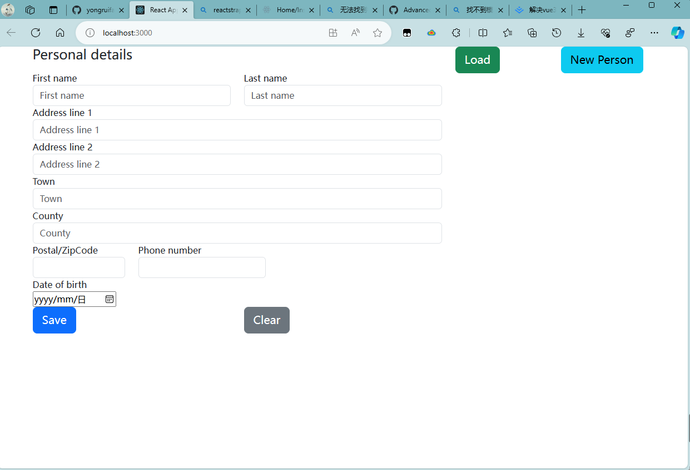

# ContactsManager
# 项目创建方式（使用TS模板）
`npx create-react-app my-app --template typescript`

# 添加Bootstrap支持
`npm install --save bootstrap reactstrap @types/bootstrap @types/reactstrap`

# 条目绑定到底层状态
问题：a `value` prop to a form field without an `onChange` handler. This will render a read-only field. If the field should be mutable use `defaultValue`. Otherwise, set either `onChange` or `readOnly`.
如果在文本框中输入内容，会发现什么也不会发生。
我们需要响应修改，然后相应地设置状态。
添加updateBinding

# 验证输入
1. 最短长度验证  
2. 正则表达式进行模式匹配  
三个部分：
1. 验证器类(Validator)：提供检查功能的类  
2. 验证类(Validation)：负责对状态的不同部分应用需要的验证项
3. FormValidation：调用验证项，利用验证失败的详细信息反馈到UI。

> 邮编和手机号采用美国标准
1. 邮编以5个数字开头，还有可选的4个数字，格式是短横线带4个数字
2. 电话号码先看示例，再总结
(555) 123-4567 
123.456.7890 
(555) 543 9876 

# 在组件中应用验证
虽然可以在主组件中进行验证，但是我们选择放到独立的验证组件FormValidation中。
验证组件接收组件的当前状态
使用返回值告知数据是否有效

# 创建数据，把数据发送给IndexedDB数据库
Web浏览器提供了对IndexedDB的支持，将IndexedDB作为数据存储，当我们重新打开页面时，个人信息仍然是可用的。
在使用数据库的过程记住两点。
1. 需要添加代码来构建数据库表。
2. 需要添加代码来保存记录到数据库中。

原先，一直在用IPersonState表示状态，在使用数据库时我们应扩展，引入一个新的IsActive
确定是否在屏幕上显示一个联系人。
我们使用一个交叉类型来处理这个需求。

# 从PersonalDetails访问数据库
